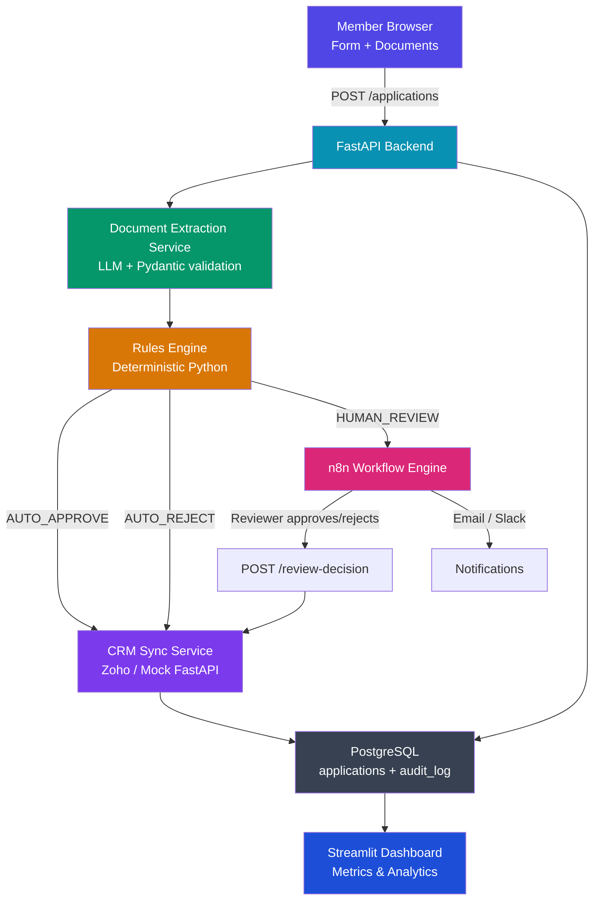

# 🏦 Credit Union Loan Onboarding System
**A Straight-Through Processing (STP) Pipeline**

> **⚠️ ALL DATA IN THIS PROJECT IS 100% SYNTHETIC.**
> No real PII is used anywhere. All applicant names, ID numbers, addresses, incomes, and documents are generated programmatically using Faker. This project is a portfolio demonstration only.

---

## 📖 Project Overview
This project is a **Loan Onboarding and Underwriting System** designed to demonstrate data engineering and workflow automation concepts for a fintech context.

The system processes a raw loan application (including unstructured documents like PDFs of IDs and Pay Stubs), automatically extracting data via LLMs and evaluating it against a deterministic rules engine to output an approval, rejection, or human review decision.

---

## 🏗️ Architecture



## 🛠️ System Architecture & Tech Stack

The project is built using a modern microservices architecture, entirely containerized using Docker.

### 1. Backend API (FastAPI)
*   **Tech:** Python, FastAPI, Pydantic, Uvicorn.
*   **Role:** The central nervous system. It exposes REST endpoints to receive applications, handles file uploads, orchestrates the extraction and rules evaluation, and manages database transactions. FastAPI's async capabilities allow it to handle multiple concurrent loan applications without blocking.

### 2. Database Layer (PostgreSQL)
*   **Tech:** PostgreSQL, SQLAlchemy (Async), Alembic, `asyncpg`.
*   **Role:** The persistent state store. We designed a relational schema optimized for financial compliance:
    *   `applications`: Stores the core applicant data and the final decision.
    *   `application_documents`: Tracks uploaded files and their specific AI extraction confidence scores.
    *   `audit_log`: An append-only immutable ledger that records every state change for compliance purposes.
*   **Migrations:** Managed via Alembic to track schema changes over time.

### 3. AI Extraction Layer (LLMs)
*   **Tech:** Groq API (openai/gpt-oss-120b and openai/gpt-oss-20b).
*   **Role:** When PDFs (Government IDs, Proof of Income) are uploaded, they are sent to the LLM to return structured JSON. The LLM extracts the structured data from unstructured text and images and returns it for evaluation.

### 4. Deterministic Rules Engine
*   **Tech:** Pure Python.
*   **Role:** The actual "decision maker". To prevent AI hallucinations from illegally approving or rejecting loans, the AI *never* makes the final decision. Instead, the Rules Engine takes the structured JSON from the AI and runs it through strict, hard-coded financial logic (e.g., `age > 18`, `loan_to_income_ratio < 5.0`, `AI_confidence > 0.80`).

### 5. Analytics Dashboard
*   **Tech:** Python, Streamlit, Pandas, Plotly.
*   **Role:** A real-time internal tool for loan officers and executives. It queries the PostgreSQL database directly to visualize KPIs like the STP rate, reasons for auto-rejection, and a queue of applications waiting for human review.

### 6. Workflow Automation (n8n)
*   **Tech:** n8n (Node-based workflow automation tool).
*   **Role:** Designed to act as the glue between the internal API and external tools (like HubSpot/Zoho CRMs or Slack notifications). When an application finishes processing, a webhook can trigger an n8n workflow to update a CRM record or ping a Slack channel.

---

## 🧠 Key Concepts Demonstrated

This project implements several engineering patterns required in the financial industry:

### 1. Probabilistic vs. Deterministic Boundaries
A common mistake in AI engineering is letting the AI make business decisions. This project enforces a strict boundary:
*   **Probabilistic (LLM):** "I am 95% confident this PDF says the user makes $5,000/month."
*   **Deterministic (Rules Engine):** "If income is $5,000, and requested loan is $50,000, the ratio is 10x. Reject the loan. Max ratio is 5x."

### 2. Straight-Through Processing (STP) & Human-in-the-Loop (HITL)
The goal is to maximize **STP** (applications processed start-to-finish with zero human touch) to save money. However, if the AI's extraction confidence is too low (e.g., a blurry ID card), or the rules engine detects an edge case, the system gracefully falls back to **HITL**. It halts automation, flags the specific issue, and pushes the application to the Streamlit Dashboard's "Human Review Queue" for a loan officer to inspect.

### 3. Auditability & Compliance
In finance, you must be able to prove *why* a decision was made (e.g., Fair Credit Reporting Act). The system implements an `audit_log` table. Every action (Submission -> AI Extraction -> Rules Check -> Final Decision) writes an immutable record with timestamps, ensuring full traceability.

### 4. Idempotency
Network requests fail. If a client submits a loan application and their internet drops before receiving a success response, they might click "Submit" again. The database uses an `idempotency_key` to ensure that duplicate requests do not result in duplicate loan applications or double-processing.

### 5. Synthetic Data Generation
To test the system at scale, we wrote a synthetic data generation script using the `Faker` library. It generated 61 realistic loan profiles, complete with mock PDF documents, allowing us to stress-test the rules engine and populate the Streamlit dashboard with meaningful data.

---

## 🚀 How the Pipeline Flows

1. **Intake:** The FastAPI endpoint receives applicant data and PDF documents.
2. **Initialization:** The database creates an `Application` row with status `SUBMITTED`. An audit log entry is written.
3. **Extraction:** The AI service reads the PDFs and extracts data (Name, DOB, Income).
4. **Evaluation:** The Rules Engine ingests the extracted data. It checks for:
    *   Missing documents
    *   Expired IDs
    *   Age limits
    *   Income thresholds
    *   LLM confidence scores
5. **Decision:** The Rules Engine outputs `AUTO_APPROVED`, `AUTO_REJECTED`, or `HUMAN_REVIEW`.
6. **Storage:** The database is updated with the final decision, the exact flags that caused it, and the raw AI extraction data.
7. **Visualization:** The Streamlit dashboard instantly reflects the new application in its pie charts and queues.

---

## 📊 Evaluation Results (66 Applications)

| Metric | Value |
|---|---|
| Synthetic Applicants Evaluated | 66 |
| Extraction Data Field Accuracy | ~98.0% |
| Straight-Through Processing (STP) Rate | 40.9% |
| Applications Auto-Rejected | 40.9% |
| Applications Queued for Manual Review | 18.2% |

---

## 🛠️ Quick Start

**1. Clone and Configure**
```bash
git clone <repo-url> && cd honest-consultant
cp .env.example .env          # fill in your LLM API key
```

**2. Start the Infrastructure**
This boots up PostgreSQL, the FastAPI backend, and the Streamlit Dashboard.
```bash
docker compose up -d --build
```

**3. Initialize the Database Schema**
This runs Alembic migrations to create all the tables in PostgreSQL.
```bash
docker compose exec api alembic upgrade head
```

**4. Generate Synthetic Data**
This creates fake loan applicants and mock PDFs in your local directory.
```bash
python data/synthetic/generate.py
```

**5. Run the Bulk Evaluation Script**
This script reads the synthetic data and pumps it through the pipeline directly into the database.
```bash
docker compose exec -e PYTHONPATH="." api python scripts/populate_db.py
```

**6. View the Ecosystem**
- **Dashboard:** http://localhost:8501
- **API Docs:** http://localhost:8000/docs
- **n8n Workflow:** http://localhost:5678

---

## 💻 Tech Stack
Python 3.11 · FastAPI · Pydantic v2 · SQLAlchemy · Alembic · PostgreSQL · n8n · Docker · Streamlit · pytest · GitHub Actions
